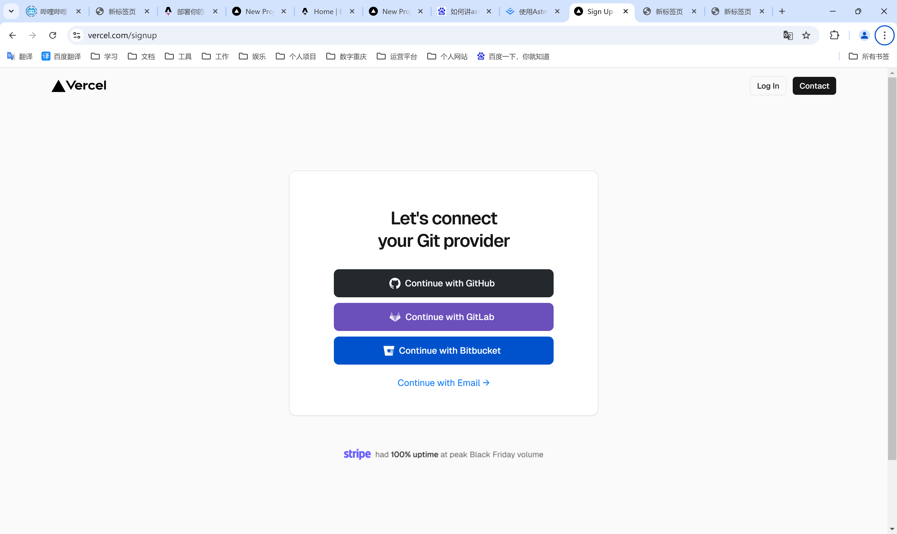
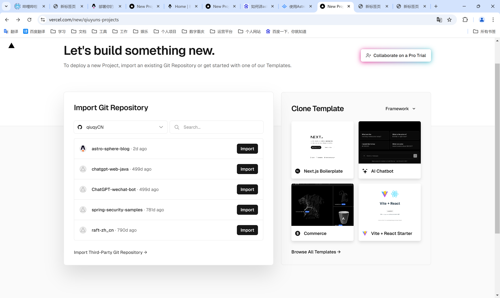
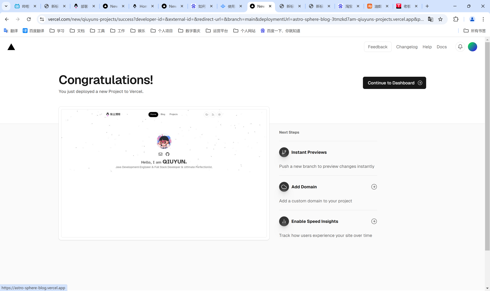
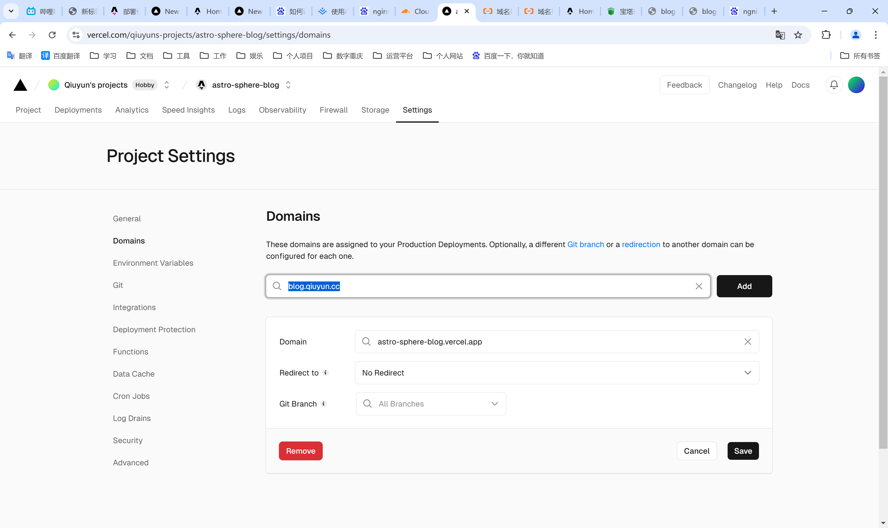
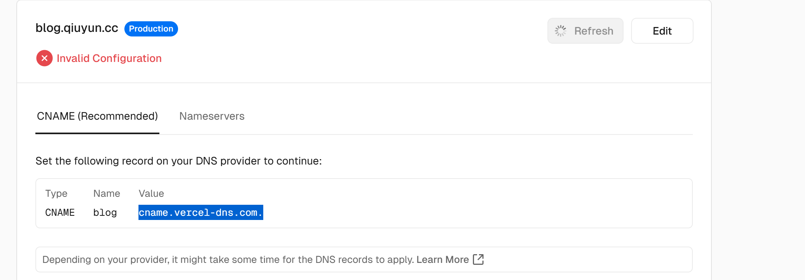
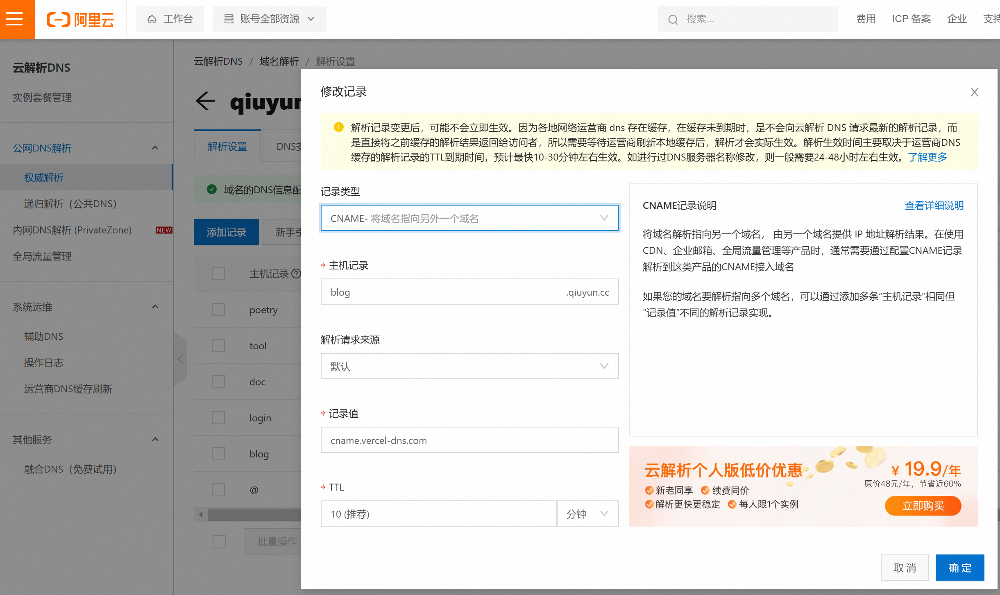
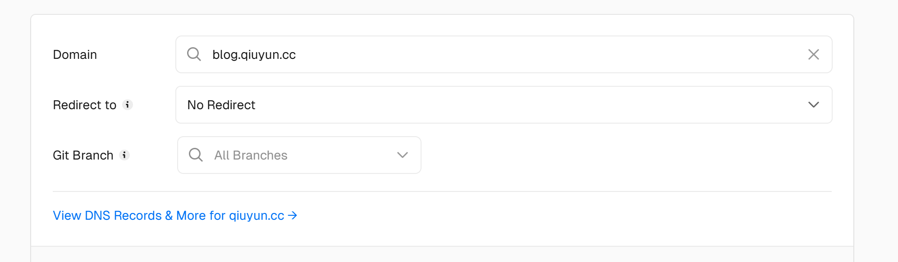

1. **部署后效果展示**
请访问   [秋云博客]( https://blog.qiuyun.cc) 查看部署效果

2. **首先你得有一个 Astro 项目**
比如说一个 Astro 构建的博客：[秋云博客 Github 地址](https://github.com/qiuqyCN/astro-sphere-blog)

3. **给项目添加 Vercel 适配器(网站使用的是静态页面，故跳过此步骤)**
在 Astro 项目根目录打开终端，执行如下命令：

```bash
npx astro add vercel
```

详情参考地址：https://docs.astro.build/zh-cn/guides/deploy/vercel/

4. **登录 Vercel **



5. **选择需要导入的项目**



6. **安装部署命令直接使用默认的即可**



7. **添加域名**



8. **给域名添加CNAME解析**
我这使用的是阿里云，在阿里云域名解析处添加如下记录







9. **完成后的效果**


