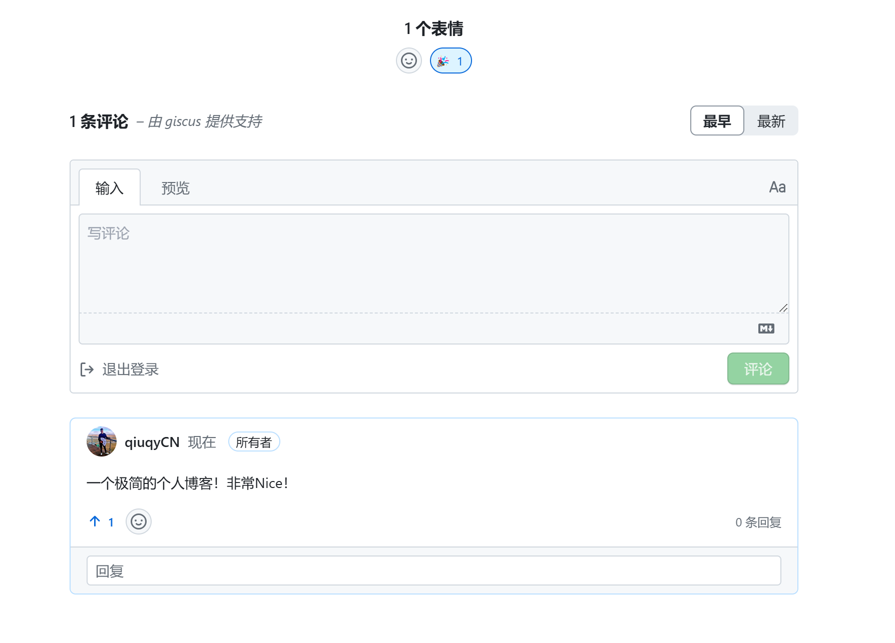
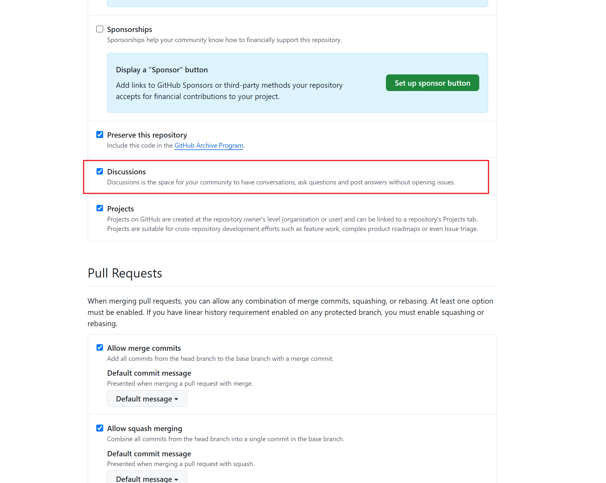
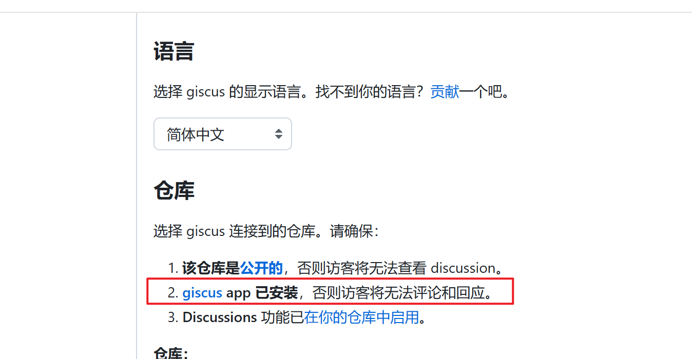
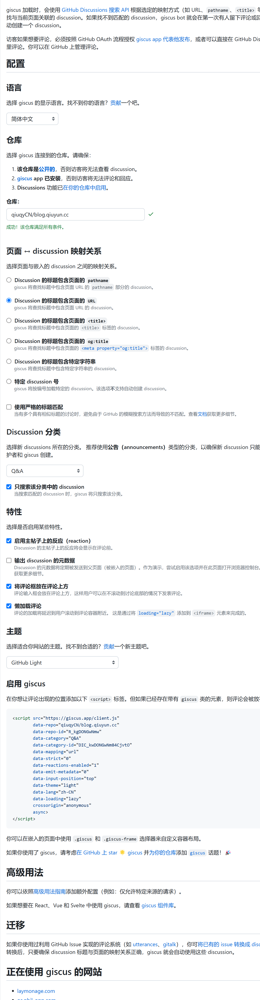

## Giscus评论系统完成后效果展示

可在[秋云博客]( https://blog.qiuyun.cc) 的博客详情和项目详情中直观看到评论系统。



## 集成步骤

1. **GIthub新建一个公开的仓库，并在新建的仓库开启 `Discussions` 功能** 
比如：`https://github.com/qiuqyCN/blog.qiuyun.cc`



3.  进入 [giscus官网](https://giscus.app/zh-CN)，安装 giscus app
单击红框处即可安装



3. 评论配置参考如下截图


4. 集成方案一， 简单集成
	- 现在您已经准备好了gisus配置，让我们创建一个名为PostComments的组件，并将代码片段添加到其中。

```js
<section class="giscus mx-auto mt-10 w-full"></section>

<script
  src="https://giscus.app/client.js"
  data-repo="username/repo"
  data-repo-id="repo-id"
  data-category="Blog Posts Comments"
  data-category-id="DIC_kwDOB3LMn84CaXpn"
  data-mapping="url"
  data-strict="0"
  data-reactions-enabled="1"
  data-emit-metadata="0"
  data-input-position="bottom"
  data-theme="preferred_color_scheme"
  data-lang="en"
  data-loading="lazy"
  crossorigin="anonymous"
  async
></script>
```

	- 现在，让我们将组件导入到博客文章布局中，并将其添加到页面底部。
  
```js
---
import Layout from "@layouts/Layout.astro";
import Footer from "@components/Footer.astro";
import PostComments from "@components/PostComments.astro";

---

<Layout>
  <main id="main-content">
    <article
      id="article"
      role="article"
      class="prose mx-auto mt-8 max-w-3xl prose-pre:border-[1px] prose-pre:border-skin-line prose-pre:border-solid"
    >
      <Content />
    </article>
    <PostComments />
  </main>
  <Footer />
</Layout>
```

1. 集成方案二，秋云博客动态切换主题的支持
新增一个PostComments.tsx，因为秋云博客使用的是solidJS，所以其中代码片段如下：

```js
import Giscus from '@giscus/solid';
import { createSignal, onCleanup, onMount } from 'solid-js';

// 定义主题类型
type Theme = 'light' | 'dark';
// 定义自定义事件的 detail 类型
interface StorageChangeDetail {
    key: string;
    newValue: string;
}

function PostComments() {
     // 从 localStorage 获取初始主题值，并提供默认值
    const initialTheme: Theme = (localStorage.getItem('theme') as Theme) || 'light';

    // 创建一个信号来存储当前的主题
    const [theme, setTheme] = createSignal<Theme>(initialTheme);

    // 定义一个函数来处理 storage 事件
    const handleStorageChange = (event: StorageEvent) => {
        if (event.key === 'theme' && (event.newValue === 'light' || event.newValue === 'dark')) {
            // 更新信号中的主题值
            setTheme(event.newValue as Theme);
            console.log(event.newValue);
        }
    };

    // 创建一个代理方法来设置 localStorage 的值
    const setLocalStorageItem = (key: string, value: string) => {
        localStorage.setItem(key, value);
        // 触发自定义事件
        const customEvent = new CustomEvent('localstorage-theme-change', {
            detail: { key, newValue: value },
        });
        window.dispatchEvent(customEvent);
    };
    
      // 监听自定义事件
      const localstorageThemeChangeListener = (e: CustomEvent<StorageChangeDetail>) => {
        // 更新信号中的主题值
        setTheme(e.detail.newValue as Theme);
        console.log(e.detail.newValue);
    };

    // 组件挂载时添加事件监听
    onMount(() => {
        // 监听自定义事件
        window.addEventListener('localstorage-theme-change', localstorageThemeChangeListener as EventListener);

        // 也监听标准的 storage 事件
        window.addEventListener('storage', (e: StorageEvent) => {
            handleStorageChange(e);
        });
    });

    // 组件卸载时移除事件监听
    onCleanup(() => {
        window.removeEventListener('localstorage-theme-change', localstorageThemeChangeListener as EventListener);
        window.removeEventListener('storage', (e: StorageEvent) => {
            handleStorageChange(e);
        });
    });


    return (
        <Giscus
          id="comments"
          repo="qiuqyCN/blog.qiuyun.cc"
          repoId="xxxxxxx"
          category="Q&A"
          categoryId="xxxxxxxxxxxxxx"
          mapping="url"
          reactionsEnabled="1"
          emitMetadata="0"
          inputPosition="top"
          theme={theme()}
          lang="zh-CN"
          loading="lazy"
        />
    );
}

export default PostComments;
```
注意将上面的Giscus参数请替换为自己的参数。
组件导入到博客文章布局中同方案一，只不过`import PostComments from "@components/PostComments"` 导入的时候没有`.astro`


## 参考文档

1. [giscus官网](https://giscus.app/zh-CN)
2. https://elazizi.com/posts/add-comments-section-to-your-astro-blog/


